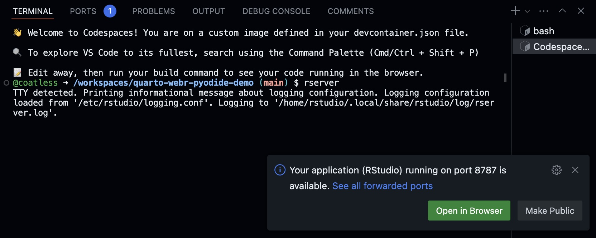
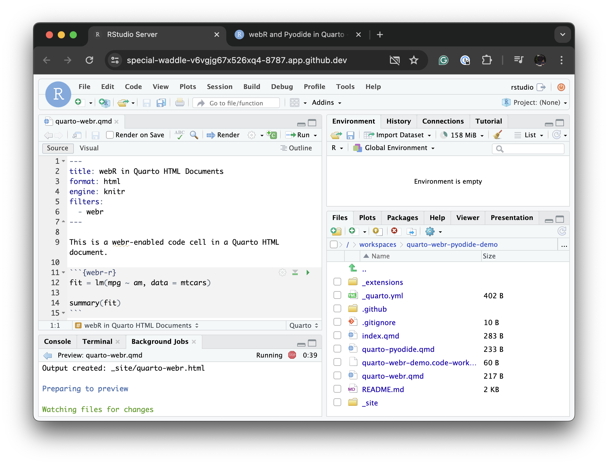

# Authoring Space with Continuous Deployment

This repository houses an example workflow that allows for continuous deployment of versioned Quarto documents that have been augmented by Quarto Extensions like [`{quarto-webr}`](https://github.com/coatless/quarto-webr) and [`{quarto-pyodide}`](https://github.com/coatless-quarto/pyodide). Feel free to clone or fork the repository!

## Authoring Workspaces

We use [Development Containers (`devcontainers`)](https://containers.dev/) to create [two different authoring workspaces](.devcontainer/) that work with [GitHub Codespaces](https://github.com/features/codespaces). These authoring spaces are setup to immediately allow you to modify and/or explore [`quarto-webr`](https://github.com/coatless/quarto-webr) and [`quarto-pyodide`](https://github.com/coatless-quarto/pyodide) projects without needing to install authoring software (Quarto, RStudio or VS Code, and the extensions) on your local computer.

> [!NOTE] 
> 
> Codespaces are available to Students and Teachers for free [up to 180 core hours per month](https://docs.github.com/en/education/manage-coursework-with-github-classroom/integrate-github-classroom-with-an-ide/using-github-codespaces-with-github-classroom#about-github-codespaces) through [GitHub Education](https://education.github.com/). Otherwise, you will have [up to 60 core hours and 15 GB free per month](https://github.com/features/codespaces#pricing).

### VS Code 

If you are comfortable with VS Code, you can try out the authoring space by clicking on the following button:

### RStudio

We also make available an RStudio Authoring Space that requires a few more steps. You can access the space by clicking on:

After the authoring space loads, click on the "Open in Browser" button in the lower right hand side to be taken into a new browser window with RStudio running: 

If you do not see the notification, please click on the "Ports" tab in the lower right hand side of VS Code and, then, find the "RStudio" label under Port column, press the globe under the "Forwarded Address" column next to "RStudio" to be taken into a web-based version of RStudio.

If done successfully, you should see a new browser window with the familiar RStudio interface:

From there, open the desired Quarto document by double clicking on it in the Files tab on the lower right hand side. Then, press the "Render" button. RStudio will then open a new tab with the rendered Quarto document. 

## Enabling GitHub Pages Deployment

> [!IMPORTANT]
> 
> This sections requires the repository to be cloned and/or forked to a personal copy for it work.

To enable deployment through GitHub Actions to GitHub Pages, please enable it on the repository by:

- Clicking on the repository's **Settings** page
- Selecting **Pages** on the left sidebar.
- Picking the **GitHub Actions** option in the **Source** drop-down under the Build and Deployment section.
- Ensuring that **Enforced HTTPS** is checked. 

[![Example annotation of the repository's Settings page for GitHub Actions deployment][1]][1]

This allows the GitHub Action in [`.github/workflows/publish-document.yml`](.github/workflows/publish-document.yml) to run each time a commit is made to the repository.

  [1]: images/enable-github-pages-via-actions.png